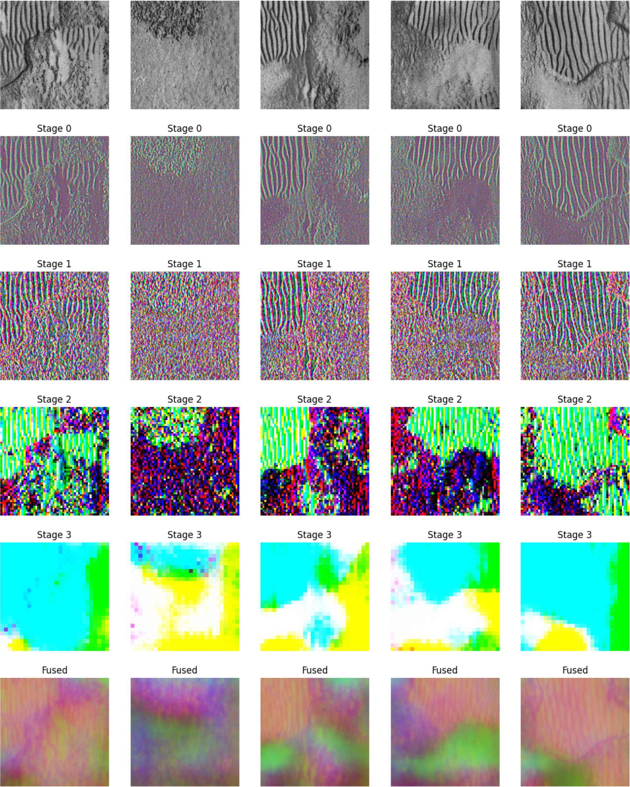

# BenthicDINO

**Physics-Informed Self-Distillation for View-Invariant Side-Scan Sonar Representations**

Official implementation of [BenthicDINO: Physics-Informed Self-Distillation for View-Invariant Side-Scan Sonar Representations](https://arxiv.org/abs/2608.23215) (Hamoda, Rajani & Gracias, 2026).

BenthicDINO is a self-supervised learning framework for **side-scan sonar (SSS) imagery**. It adapts the DINO/iBOT family of self-distillation methods to underwater sonar, where annotations are scarce and expensive, producing general-purpose 2D features for downstream benthic tasks such as shipwreck detection and sediment segmentation.



## ✨ Highlights

- **Sonar-physics-aware augmentations** — speckle noise, TVG attenuation (propagation-loss simulation), and gain/dynamic-range jitter. Blur and aspect-ratio distortion are deliberately avoided since they break the physics of sonar imaging.
- **Sparse ConvNeXtV2 backbone** — masked patches are processed truly sparsely with submanifold sparse convolutions ([spconv](https://github.com/traveller59/spconv)), with a lightweight MAE-style decoder to inject context into masked sites.
- **Multi-scale hypercolumn features** — an MLP-based fusion of all encoder stages yields a semantically compressed, high-resolution patch representation.
- **Composite objective** — DINO (self-distillation) + iBOT (masked patch distillation) + Gram (texture matching against a frozen teacher) + KoLeo (feature uniformity), with a physics-based HSIC term that encourages **independence from nadir distance** to remove range-dependent artifacts.
- **Two-stage training** — FCMAE masked-reconstruction pretraining, followed by full self-distillation.

## 🗂️ Repository Structure

```
BenthicDINO/
├── train.py                  # Stage 2: DINO + iBOT self-distillation training
├── pretrain.py               # Stage 1: FCMAE masked-reconstruction pretraining
├── src/
│   ├── dino.py               # Sparse ConvNeXtV2 backbone, DINOHead, ReconstructionHead
│   ├── dataset.py            # Sonar dataset, multi-crop transforms, block masking
│   ├── losses.py             # DINO, iBOT, Gram, KoLeo, HSIC losses
│   └── utils.py              # Inference helpers, mIoU evaluation, model loading
├── scripts/
│   ├── process_benthicat.py  # XTF sonar → normalized tiles + nadir-distance maps
│   └── process_shipwrecks.py # AI4Shipwrecks labeled data → image/mask crops
└── notebooks/                # Evaluation & feature-space analysis
    ├── ai4shipwrecks.ipynb   # Shipwreck segmentation evaluation
    ├── s3seg.ipynb           # Sediment classification evaluation
    ├── augmentations.ipynb   # Augmentation visualization
    ├── feature_space.ipynb   # Feature-space analysis
    ├── knn_vis.ipynb         # kNN visualization (faiss)
    ├── pca_vis.ipynb         # PCA visualization
    ├── svd_features.ipynb    # SVD feature analysis
    ├── sas_test.ipynb       # Synthetic aperture sonar tests
    └── graphs.ipynb          # Training curves
```

## 🚀 Getting Started

### 1. Installation

```bash
pip install -r requirements.txt
```

> **Note:** `requirements.txt` installs `spconv-cu120`; match this to your CUDA version if needed.

### 2. Data Preparation

Place raw XTF side-scan files under `data/dataset/` (one subdirectory per survey), then run:

```bash
python scripts/process_benthicat.py
```

This converts the XTF waterfalls into overlapping 768×768 tiles (`.npz` with intensity and nadir-distance maps, plus `.png` previews), excluding the noisy nadir region, and writes dataset normalization statistics to `data/stats.txt`.

For the labeled AI4Shipwrecks evaluation set:

```bash
python scripts/process_shipwrecks.py
```

### 3. Stage 1 — FCMAE Pretraining (optional warm-up)

```bash
torchrun --nproc_per_node=n pretrain.py
```

Trains the backbone with masked image modeling (60% block masking) and saves `weights/pretrained.pth`.

### 4. Stage 2 — Self-Distillation Training

```bash
torchrun --nproc_per_node=n train.py
```

where `n` is the number of GPUs. Training uses an effective batch size of 8192 (via gradient accumulation), cosine schedules for LR, teacher temperature, and EMA momentum, and mixed precision.

### 5. Inference & Evaluation

```python
from src.utils import load_model, run_inference_heads

backbone, dino_head, ibot_head = load_model("weights/checkpoint_latest.pth")
dino_out, ibot_out, stage_features = run_inference_heads(backbone, dino_head, ibot_head, tile)
```

The `notebooks/` directory contains full evaluation pipelines (shipwreck segmentation, sediment classification) and feature-space analyses (PCA, kNN, SVD).

# BenthicDINO

**Physics-Informed Self-Distillation for View-Invariant Side-Scan Sonar Representations**

Official implementation of [BenthicDINO: Physics-Informed Self-Distillation for View-Invariant Side-Scan Sonar Representations](https://arxiv.org/abs/2608.23215) (Hamoda, Rajani &amp; Gracias, 2026).

BenthicDINO is a self-supervised learning framework for **side-scan sonar (SSS) imagery**. It adapts the DINO/iBOT family of self-distillation methods to underwater sonar, where annotations are scarce and expensive, producing general-purpose 2D features for downstream benthic tasks such as shipwreck detection and sediment segmentation.

## ✨ Highlights

- **Sonar-physics-aware augmentations** — speckle noise, TVG attenuation (propagation-loss simulation), and gain/dynamic-range jitter. Blur and aspect-ratio distortion are deliberately avoided since they break the physics of sonar imaging.
- **Sparse ConvNeXtV2 backbone** — masked patches are processed truly sparsely with submanifold sparse convolutions ([spconv](https://github.com/traveller59/spconv)), with a lightweight MAE-style decoder to inject context into masked sites.
- **Multi-scale hypercolumn features** — an MLP-based fusion of all encoder stages yields a semantically compressed, high-resolution patch representation.
- **Composite objective** — DINO (self-distillation) + iBOT (masked patch distillation) + Gram (texture matching against a frozen teacher) + KoLeo (feature uniformity), with an optional HSIC-based term that encourages **independence from nadir distance** to remove range-dependent artifacts.
- **Two-stage training** — FCMAE masked-reconstruction pretraining, followed by full self-distillation.

## 🗂️ Repository Structure

```
BenthicDINO/
├── train.py                  # Stage 2: DINO + iBOT self-distillation training
├── pretrain.py               # Stage 1: FCMAE masked-reconstruction pretraining
├── src/
│   ├── dino.py               # Sparse ConvNeXtV2 backbone, DINOHead, ReconstructionHead
│   ├── dataset.py            # Sonar dataset, multi-crop transforms, block masking
│   ├── losses.py             # DINO, iBOT, Gram, KoLeo, HSIC losses
│   └── utils.py              # Inference helpers, mIoU evaluation, model loading
├── scripts/
│   ├── process_benthicat.py  # XTF sonar → normalized tiles + nadir-distance maps
│   └── process_shipwrecks.py # AI4Shipwrecks labeled data → image/mask crops
└── notebooks/                # Evaluation & feature-space analysis
    ├── ai4shipwrecks.ipynb   # Shipwreck segmentation evaluation
    ├── s3seg.ipynb           # Sediment classification evaluation
    ├── augmentations.ipynb   # Augmentation visualization
    ├── feature_space.ipynb   # Feature-space analysis
    ├── knn_vis.ipynb         # kNN visualization (faiss)
    ├── pca_vis.ipynb         # PCA visualization
    ├── svd_features.ipynb    # SVD feature analysis
    ├── sas_test.ipynb        # Synthetic aperture sonar tests
    └── graphs.ipynb          # Training curves
```

## 🏋️ Pretrained Weights

Pretrained model weights are available for download:

- [**Download weights**](http://gofile.me/3ElAm/WdgOHxuVt)

The archive contains the trained checkpoint (`student` backbone, DINO/iBOT heads, teacher networks, and optimizer state) compatible with `src/utils.load_model` and the evaluation notebooks.

## 🧪 Method Overview

During training, each sonar tile produces 2 global crops and 8 local crops. A **student** network sees augmented, partially masked crops; an EMA **teacher** sees clean global crops. The total loss combines:

| Loss | Role |
|---|---|
| **DINO** | Cross-crop self-distillation with EMA centering |
| **iBOT** | Patch-level distillation on masked patches |
| **Gram** | Feature autocorrelation (texture) matching against a frozen teacher |
| **KoLeo** | Uniformity of the CLS embedding space |
| **HSIC** | Independence of patch features from nadir distance |

See the paper for the full method and ablations.

## 📜 Citation

If you find this work useful, please cite:

```bibtex
@misc{hamoda2026benthicdinophysicsinformedselfdistillationviewinvariant,
      title={BenthicDINO: Physics-Informed Self-Distillation for View-Invariant Side-Scan Sonar Representations}, 
      author={Taqi Hamoda and Hayat Rajani and Nuno Gracias},
      year={2026},
      eprint={2608.23215},
      archivePrefix={arXiv},
      primaryClass={cs.CV},
      url={https://arxiv.org/abs/2608.23215}, 
}
```

## 📄 License

This project is released under the MIT License. See [LICENSE](LICENSE) for details.